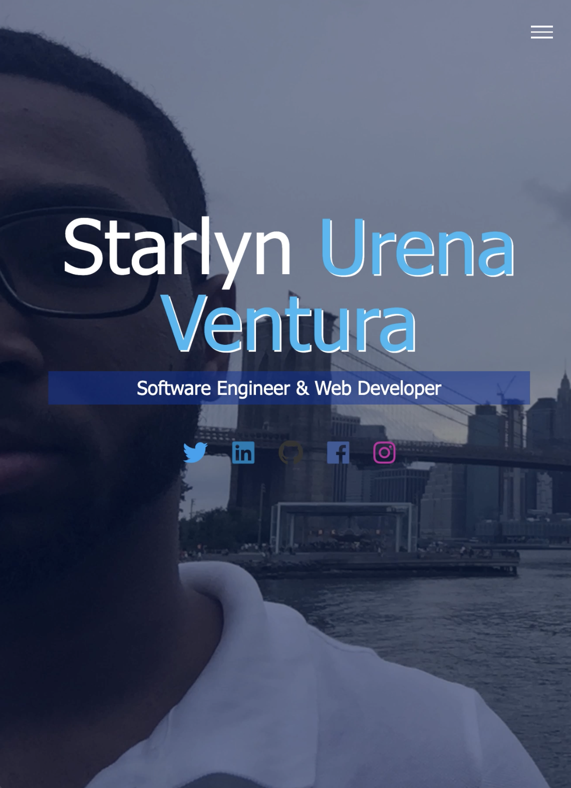
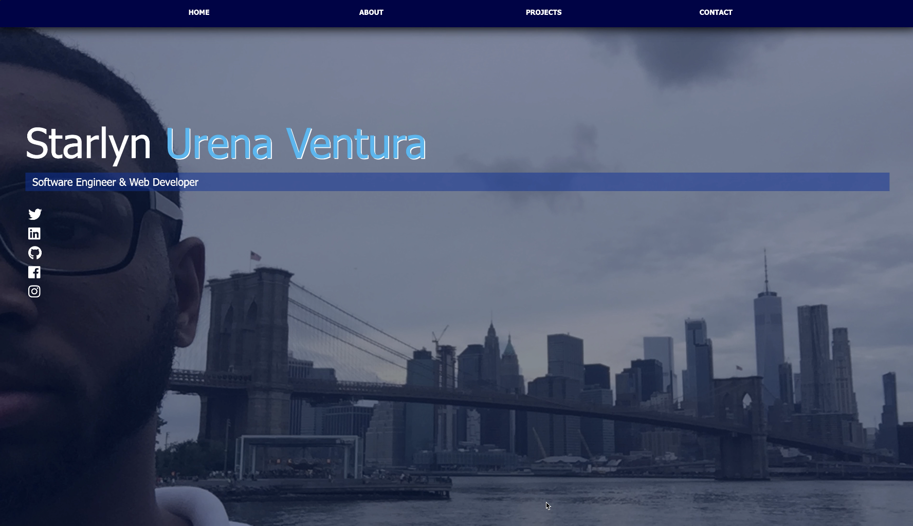

# Portfolio

## Requirements
 * Make sure you have installed `node && npm `
 * If not then follow click here [nodeJS](https://www.npmjs.com/get-npm)。

## How to Run It
 * Clone the repo
 * Run `npm install` to get all the modules
 * All needed dependencies will be installed.
 * Download all the dependencies needed to run the web app.
  *Nodemon* 
  *pg*
 * Run `npm start`
 * Now you should be able to visit `localhost:4000`

## Demo Images / Video

 
